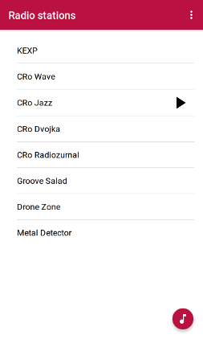

# PiRadio

Android application that allows you to control [PiRadio server running on RaspberryPi](https://github.com/stepanmracek/piradio-py)

# Installation

1. Install [Android SDK](https://developer.android.com/studio/?hl=ja#downloads)
2. Install [NodeJS](https://nodejs.org/en/)
3. Install [Cordova](https://cordova.apache.org/) and [Ionic Framework](https://ionicframework.com/)
   - `$ npm install cordova ionic -g`
4. Run the app
   - `$ ionic cordova run android`
